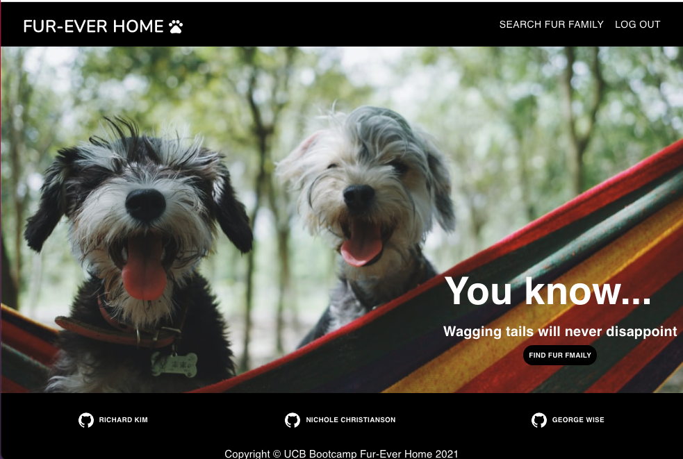
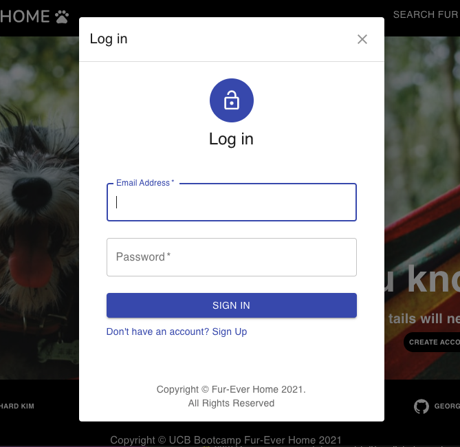
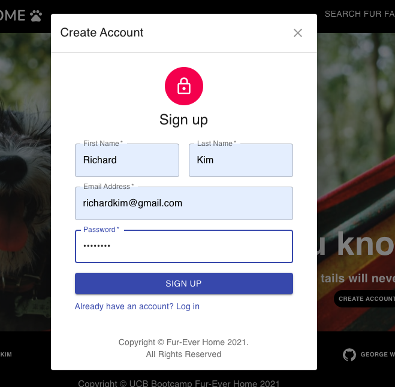
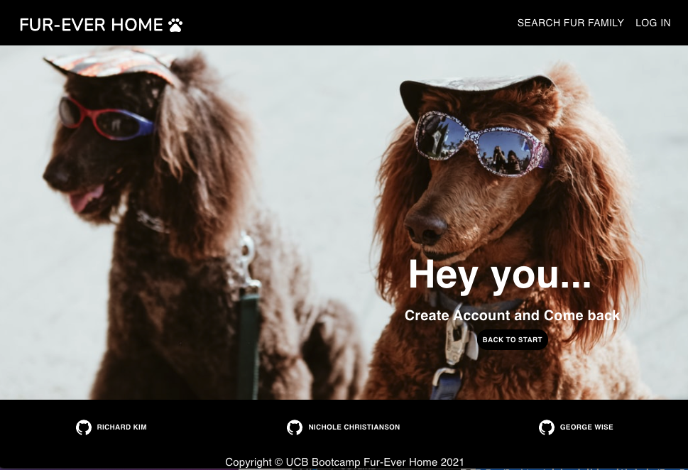
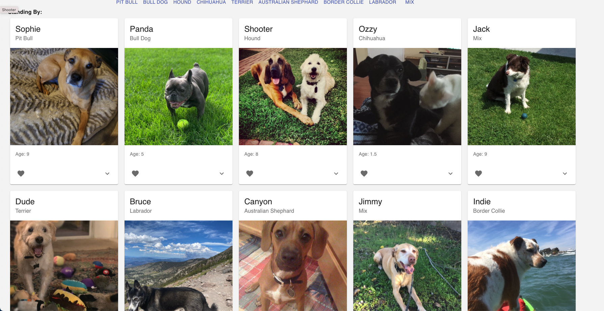

### 24. Interactive MERN SPA Project

## Description 

We all love animals, an consider them as friends and family, yet finding the perfect animal Fur you can be quite a challenge. Making an informed choice based on both you and your potential fur-ever pet’s needs is essential. Some animals are high maintenance, some relaxed, some good with kids and some love swimming! Although there is not one perfect pet Fur everyone, there are many reasons why you should consider adopting.

 We’re here to change that, by helping users to search for pets so you can see who’s ready to be a part of your Fur-Ever Family, and to help these animals find a Fur-Ever Home.

## Table of Contents (Optional)

* [Installation](#installation)
* [Usage](#usage)
* [Technology](#technology)
* [Credits](#credits)
* [License](#license)

## Installation

- Please visit Website https://shielded-castle-31591.herokuapp.com/

# Usage 

- Welcome to Furever Home

- Please log in before you search for furever family

- if you do not have account please create account

- if you are reaching website without permission they will block the way of entering it

- Once you log in your family-to-be will be show up

- click expand to see their introduction
- click heart to reserve adoption ;)

## Technology
    - Express
    - Npm
    - Java Script
    - nodejs
    - react
   

## Credits

 - Richard Kim: richardyjkim (github)
 - Goerge Wise: Stubblefish (github)
 - Nichole Christianson: nmchristianson (github)

## License

MIT License

Copyright (c) [2021] [Richard Y Kim]

Permission is hereby granted, free of charge, to any person obtaining a copy
of this software and associated documentation files (the "Software"), to deal
in the Software without restriction, including without limitation the rights
to use, copy, modify, merge, publish, distribute, sublicense, and/or sell
copies of the Software, and to permit persons to whom the Software is
furnished to do so, subject to the following conditions:

The above copyright notice and this permission notice shall be included in all
copies or substantial portions of the Software.

THE SOFTWARE IS PROVIDED "AS IS", WITHOUT WARRANTY OF ANY KIND, EXPRESS OR
IMPLIED, INCLUDING BUT NOT LIMITED TO THE WARRANTIES OF MERCHANTABILITY,
FITNESS FOR A PARTICULAR PURPOSE AND NONINFRINGEMENT. IN NO EVENT SHALL THE
AUTHORS OR COPYRIGHT HOLDERS BE LIABLE FOR ANY CLAIM, DAMAGES OR OTHER
LIABILITY, WHETHER IN AN ACTION OF CONTRACT, TORT OR OTHERWISE, ARISING FROM,
OUT OF OR IN CONNECTION WITH THE SOFTWARE OR THE USE OR OTHER DEALINGS IN THE
SOFTWARE.

© 2021 Trilogy Education Services, LLC, a 2U, Inc. brand. Confidential and Proprietary. All Rights Reserved.
